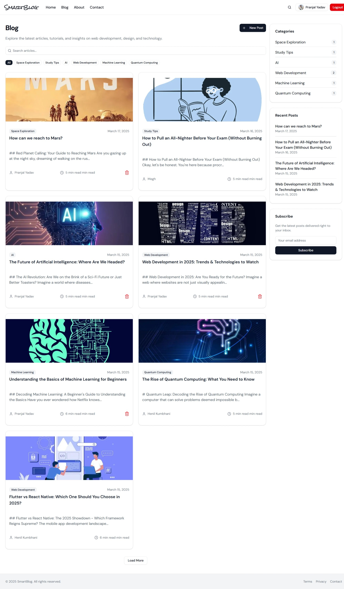

<p align="center">
  
</p>

SmartBlog is a modern blogging platform built with **Next.js**, **Spring Boot**, and **Google Gemini AI**. It enables users to create, edit, and publish blog posts with AI-powered content generation.

🚀 **Live Demo:** [SmartBlog](https://smart-blog-one.vercel.app)

## ✨ Features

- 📝 **AI-Generated Blog Posts** using Google Gemini API
- 🔥 **Modern UI** built with Next.js
- ⚡ **Fast & Scalable Backend** powered by Spring Boot
- 🔒 **Secure Authentication & Authorization**
- 📢 **User-Friendly Blogging Experience**

## 📸 Screenshots

<p align="center">
  
</p>
<br/>
<p align="center">
  
</p>
<br/>
<p align="center">
  
</p>
<br/>
<p align="center">
  
</p>

---

## 🛠 Installation

### Frontend (Next.js)

1. Clone the repository:
   ```sh
   git clone https://github.com/pranjal-yadav05/SmartBlog.git
   cd SmartBlog
   ```
2. Install dependencies:
   ```sh
   npm install
   ```
3. Set environment variables:
   Create a `.env` file and add the following:
   ```env
   NEXT_PUBLIC_API_URL=your-backend-url
   ```
   Replace `your-backend-url` with the actual backend URL.
4. Run the development server:
   ```sh
   npm run dev
   ```
   Open [http://localhost:3000](http://localhost:3000) in your browser.

### Backend (Spring Boot)
The backend is available in a separate repository: [SmartBlog Backend](https://github.com/pranjal-yadav05/smartblogbackend)

To set up the backend, follow the instructions provided in the backend repository.

---

## 🤝 Contributing

Contributions are welcome! Feel free to open issues or submit pull requests.

---

## 📜 License

This project is licensed under the **MIT License**.

---

## 📬 Contact

For any inquiries, reach out at [your.email@example.com](mailto:your.email@example.com).
